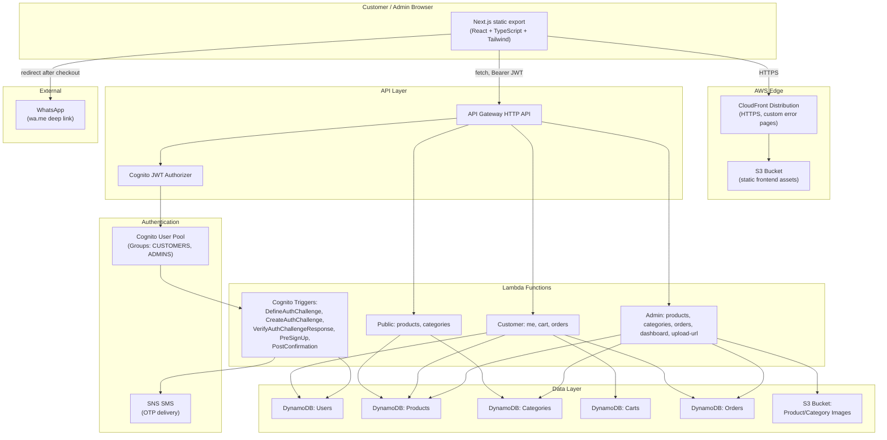

# Sangameshwara Kiranam & General Store — Grocery E-Commerce Platform

A full-stack, production-oriented grocery/general-store e-commerce platform built entirely on AWS. Customers browse products, search, add to cart, and check out through a WhatsApp order confirmation flow. Store owners manage products, categories, and orders through a dedicated admin panel — no AWS Console access required for day-to-day operation.

The UI/UX is inspired by the general shopping structure of [KPN Fresh](https://www.kpnfresh.com/) (category browsing, product cards, cart flow) but uses entirely original branding, copy, and code.

---

## Table of contents

1. [Architecture](#architecture)
2. [Project structure](#project-structure)
3. [Tech stack](#tech-stack)
4. [Local development](#local-development)
5. [AWS deployment](#aws-deployment)
6. [Environment variables](#environment-variables)
7. [Cognito authentication (customer + admin)](#cognito-authentication-customer--admin)
8. [Creating the first admin user](#creating-the-first-admin-user)
9. [DynamoDB tables](#dynamodb-tables)
10. [S3 buckets](#s3-buckets)
11. [Seeding demo products](#seeding-demo-products)
12. [WhatsApp checkout configuration](#whatsapp-checkout-configuration)
13. [CI/CD pipeline](#cicd-pipeline)
14. [Security model](#security-model)
15. [Known limitations & manual steps](#known-limitations--manual-steps)

---

## Architecture



### Request flow summary

- **Frontend**: Next.js (App Router) compiled to a fully static export (`output: "export"`) — there is no Node.js server at runtime. All data fetching happens client-side against API Gateway.
- **Hosting**: S3 (private bucket) + CloudFront (HTTPS, Origin Access Control). No custom domain is configured by default — the app is reachable at the CloudFront default domain until you attach one (see [Known limitations](#known-limitations--manual-steps)).
- **API**: API Gateway HTTP API. Public routes (`/products`, `/categories`) are unauthenticated; all `/me`, `/cart`, `/orders`, and `/admin/*` routes require a valid Cognito JWT, verified by API Gateway's built-in JWT authorizer before the Lambda ever runs.
- **Compute**: Individual Lambda functions per operation (not one monolithic handler), each with least-privilege IAM grants to only the DynamoDB tables/S3 bucket it needs.
- **Auth**: Amazon Cognito, phone number + OTP ("passwordless") for both customers and admins, backed by a custom-auth Lambda trigger chain that sends OTPs via SNS SMS.
- **Data**: Five DynamoDB tables (Users, Products, Categories, Carts, Orders), each purpose-built rather than a single overloaded table.
- **WhatsApp**: Orders are created and persisted in DynamoDB *before* the customer is redirected to WhatsApp, so an order is never lost even if the redirect fails.

---

## Project structure

```
sangameshwara-kiranam/
├── frontend/            Next.js app (static export) — customer + admin UI
│   ├── app/             Routes (App Router)
│   ├── components/      UI components (home, products, cart, admin, ui)
│   ├── context/         AuthContext, CartContext, ToastContext
│   ├── hooks/           useProducts, useCategories, useDebouncedValue
│   ├── lib/             api.ts (API client), env.ts
│   └── types/           Shared frontend TypeScript types
│
├── backend/             Lambda function source (TypeScript)
│   └── src/
│       ├── common/      Shared: http, auth, dynamo, validation, types, order-utils
│       └── functions/
│           ├── products/    GET /products, GET /products/{id}
│           ├── categories/   GET /categories
│           ├── users/        GET/PUT /me
│           ├── cart/         GET/POST /cart, PUT/DELETE /cart/{productId}
│           ├── orders/       POST/GET /orders, GET /orders/{orderId}
│           ├── admin/        All /admin/* endpoints
│           └── auth/         Cognito custom-auth Lambda triggers
│
├── infrastructure/      AWS CDK app (TypeScript)
│   ├── bin/app.ts        Entry point, wires all stacks
│   └── lib/
│       ├── config.ts             Environment/context configuration
│       ├── database-stack.ts     DynamoDB tables + GSIs
│       ├── storage-stack.ts      Product images S3 bucket
│       ├── auth-stack.ts         Cognito User Pool, groups, triggers
│       ├── api-stack.ts          API Gateway + all Lambda functions
│       ├── frontend-stack.ts     Frontend S3 bucket + CloudFront
│       └── pipeline-stack.ts     Optional CI/CD (CodePipeline/CodeBuild)
│
├── scripts/seed/         Seeds DynamoDB with demo categories + 160 products
└── README.md
```

---

## Tech stack

| Layer | Technology |
|---|---|
| Frontend | Next.js 16 (App Router, static export), React 19, TypeScript, Tailwind CSS 4 |
| Frontend auth client | `amazon-cognito-identity-js` (Cognito custom-auth / OTP flow) |
| Backend | AWS Lambda (Node.js 20, TypeScript), AWS SDK v3 |
| API | Amazon API Gateway (HTTP API) with a Cognito JWT authorizer |
| Database | Amazon DynamoDB (5 tables, on-demand billing) |
| Auth | Amazon Cognito (User Pool, custom-auth OTP flow, groups) |
| File storage | Amazon S3 (product images, presigned uploads) |
| Hosting | Amazon S3 + Amazon CloudFront |
| Infrastructure | AWS CDK v2 (TypeScript) |
| CI/CD | AWS CodePipeline + CodeBuild (optional, see [CI/CD pipeline](#cicd-pipeline)) |
| Order notification | WhatsApp (`wa.me` deep link, no third-party API) |

> **Why Next.js instead of Vite + React Router?** The original spec called for Vite + React Router, but the workspace already contained a partially-built Next.js (App Router) frontend. Next.js's static export (`output: "export"`) produces the exact same artifact shape — a folder of plain HTML/CSS/JS — that Vite would, and deploys identically to S3 + CloudFront. Reusing Next.js preserved the existing work without any loss of capability; this is documented here as the one deliberate deviation from the original tech stack request.

---

## Local development

Each subproject (`frontend/`, `backend/`, `infrastructure/`, `scripts/seed/`) has its own `package.json` and is installed/run independently.

### Frontend

```bash
cd frontend
npm install
cp .env.example .env.local   # fill in values after you deploy the backend (see below)
npm run dev                  # http://localhost:3000
```

The frontend calls the deployed API Gateway URL and Cognito User Pool directly — there is no local mock backend. You must deploy the infrastructure stacks (or at minimum Auth + Database + Api) before the app is functional locally.

### Backend

The backend has no standalone "run" step — Lambda functions are only invoked through API Gateway/Cognito once deployed via CDK. You can still typecheck and unit-test individual handlers:

```bash
cd backend
npm install
npm run typecheck
```

### Infrastructure (CDK)

```bash
cd infrastructure
npm install
npx cdk synth -c envName=dev -c adminWhatsappNumber=+91XXXXXXXXXX -c awsAccount=<your-account-id> -c awsRegion=ap-south-1
```

`cdk synth` was used throughout development to validate every stack. Actual deployment (`cdk bootstrap` / `cdk deploy`) was **not** run against any AWS account as part of this build — see [AWS deployment](#aws-deployment) for exactly how to do it yourself.

---

## AWS deployment

> **This repository was built and verified (`cdk synth`, `tsc --noEmit`, `next build`) but was not deployed to AWS.** Deployment is a real, billable action against your AWS account and is left for you to run deliberately. The steps below are exactly what to run.

### 1. Prerequisites

- AWS CLI v2, configured with credentials for the target account (`aws configure` or SSO).
- Node.js 20+.
- Your admin WhatsApp number in E.164 format (e.g. `+919502003898`).
- Decide on a region — this project defaults to `ap-south-1` (Mumbai) since it targets Indian customers.

### 2. Bootstrap CDK (one-time per account/region)

```bash
cd infrastructure
npm install
npx cdk bootstrap aws://<account-id>/ap-south-1
```

### 3. Deploy all stacks

```bash
npx cdk deploy --all \
  -c envName=dev \
  -c awsAccount=<account-id> \
  -c awsRegion=ap-south-1 \
  -c adminWhatsappNumber=+919502003898 \
  -c corsAllowedOrigin="*"
```

This deploys, in order: `Sangameshwara-dev-Database`, `Sangameshwara-dev-Storage`, `Sangameshwara-dev-Auth`, `Sangameshwara-dev-Api`, `Sangameshwara-dev-Frontend`, `Sangameshwara-dev-Pipeline` (a no-op unless you've configured GitHub CI/CD — see below).

Note the outputs printed at the end, especially:
- `Sangameshwara-dev-Frontend.DistributionDomainName` — your CloudFront URL.
- `Sangameshwara-dev-Frontend.FrontendBucketName` — where to upload the built frontend.
- The API Gateway URL (visible in the `Sangameshwara-dev-Api` stack outputs / API Gateway console).
- The Cognito User Pool ID and Client ID (`Sangameshwara-dev-Auth` stack / Cognito console).

For a production environment, repeat with `-c envName=prod` (this uses `RETAIN` removal policies on stateful resources instead of `DESTROY`).

### 4. Configure and build the frontend

```bash
cd frontend
cp .env.example .env.production
# Edit .env.production with the outputs from step 3:
#   NEXT_PUBLIC_API_URL=https://<api-id>.execute-api.ap-south-1.amazonaws.com
#   NEXT_PUBLIC_COGNITO_USER_POOL_ID=ap-south-1_XXXXXXXXX
#   NEXT_PUBLIC_COGNITO_CLIENT_ID=<client-id>
#   NEXT_PUBLIC_AWS_REGION=ap-south-1
#   NEXT_PUBLIC_STORE_WHATSAPP_NUMBER=+919502003898

npm install
npm run build   # outputs to frontend/out/
```

### 5. Deploy the frontend to S3 + invalidate CloudFront

```bash
aws s3 sync ./out s3://<FrontendBucketName> --delete
aws cloudfront create-invalidation --distribution-id <DistributionId> --paths "/*"
```

Your site is now live at `https://<DistributionDomainName>`.

### 6. Seed demo products

See [Seeding demo products](#seeding-demo-products) below.

### 7. Create the first admin

See [Creating the first admin user](#creating-the-first-admin-user) below — **do this before trying to log into `/admin/login`**, or you'll be correctly rejected.

### Custom domain (optional, later)

You mentioned you'll buy a domain later. When ready:

1. Request/import an ACM certificate **in `us-east-1`** (CloudFront requires this regardless of your app's region) for your domain.
2. Redeploy with `-c domainName=www.yourdomain.in -c certificateArn=<acm-cert-arn>`.
3. Point your domain's DNS (CNAME/ALIAS) at the CloudFront distribution domain.

---

## Environment variables

Each subproject has its own `.env.example`:

- [`frontend/.env.example`](frontend/.env.example) — `NEXT_PUBLIC_*` values baked into the static build. **Never put secrets here** — they are visible in the browser.
- [`backend/.env.example`](backend/.env.example) — reference only; these are actually injected by CDK (`infrastructure/lib/api-stack.ts`) at deploy time, not read from a `.env` file in production.
- [`infrastructure/.env.example`](infrastructure/.env.example) — deployment-time configuration passed via `-c key=value` CDK context flags (or the equivalent environment variables).

Nothing in this project stores AWS secret keys, Cognito client secrets, or passwords in source control. The frontend's Cognito Client is configured with **no client secret** (public SPA client), which is standard and required for a browser-based Cognito flow.

---

## Cognito authentication (customer + admin)

Both customer and admin authentication use the exact same mechanism: **mobile number + OTP**, no passwords.

1. User enters their mobile number on `/login` (customer) or `/admin/login` (admin).
2. The frontend calls Cognito's `signUp` (idempotent — ignored if the user already exists) then `initiateAuth` with `CUSTOM_AUTH`.
3. Cognito invokes the `CreateAuthChallenge` Lambda trigger (`backend/src/functions/auth/create-auth-challenge.ts`), which generates a 6-digit OTP and sends it via **Amazon SNS SMS**. The OTP itself is only ever stored server-side in Cognito's private challenge parameters — it never reaches the frontend.
4. The user enters the OTP; the frontend calls `sendCustomChallengeAnswer`.
5. Cognito invokes `VerifyAuthChallengeResponse`, which checks the OTP and its 5-minute expiry.
6. On success, `PostConfirmation` (first-time sign-up only) creates a `UserRecord` in the Users table with `role: "CUSTOMER"` and adds the user to the **`CUSTOMERS`** Cognito group.
7. Cognito issues an ID token containing a `cognito:groups` claim.

The frontend reads `cognito:groups` from the decoded ID token to decide whether to show admin navigation (`isAdmin` in `AuthContext`). **This is a UX convenience only.** The backend independently re-verifies group membership on every `/admin/*` request via `requireAdmin()` (`backend/src/common/auth.ts`), which reads the claim from the JWT that API Gateway has already cryptographically verified. A user cannot fake admin access by modifying frontend state or calling the API directly.

> **Note on SNS SMS in sandbox mode:** New AWS accounts start in the SNS SMS *sandbox*, which only allows sending to phone numbers you've explicitly verified in the SNS console. To send OTPs to arbitrary customer numbers, request production access via **AWS Support Center → SNS SMS spending limit / origination identity** (this is a manual step only you can request, tied to your account and use case).

---

## Creating the first admin user

The `ADMINS` Cognito group is **never** assigned automatically — not by sign-up, not by any Lambda trigger, not by any frontend code. This is intentional: it is the one privileged action that must be a deliberate, out-of-band decision by whoever controls the AWS account.

After deploying and after the intended admin has signed up once as a normal customer (completed the OTP flow at least once, so their Cognito user exists), run:

```bash
aws cognito-idp admin-add-user-to-group \
  --user-pool-id <UserPoolId> \
  --username +919502003898 \
  --group-name ADMINS \
  --region ap-south-1
```

- `<UserPoolId>` is in the `Sangameshwara-dev-Auth` stack outputs or the Cognito console.
- `--username` is the admin's mobile number in E.164 format (this is how the User Pool is configured — phone number is the username/alias).

After this, the admin should log out and log back in at `/admin/login` (or simply request a fresh OTP) so their next ID token includes the `ADMINS` group claim. No code changes or redeployment are needed to promote additional admins later — repeat this command for each one.

To verify group membership:

```bash
aws cognito-idp admin-list-groups-for-user \
  --user-pool-id <UserPoolId> \
  --username +919502003898 \
  --region ap-south-1
```

---

## DynamoDB tables

Each entity has its own table (not a single-table design), per the project's data-modeling requirement:

| Table | Partition key | GSI | Purpose |
|---|---|---|---|
| `sangameshwara-<env>-users` | `userId` (Cognito sub) | `MobileNumberIndex` (`mobileNumber`) | Customer/admin profile, role, address |
| `sangameshwara-<env>-categories` | `categoryId` | — | Category catalog |
| `sangameshwara-<env>-products` | `productId` | `CategoryIndex` (`categoryId`, `productName`) | Product catalog, price, stock |
| `sangameshwara-<env>-carts` | `userId` | — | One cart item list per authenticated user |
| `sangameshwara-<env>-orders` | `orderId` | `CustomerIdIndex` (`customerId`, `createdAt`) | Orders; also stores per-day atomic order-number counters (`COUNTER#YYYYMMDD` keys) |

All tables use on-demand (`PAY_PER_REQUEST`) billing. Point-in-time recovery is enabled for Users/Products/Orders in the `prod` environment only (`envName=prod`).

Cognito passwords are never stored anywhere — Cognito manages credentials entirely; DynamoDB only stores the profile/business data linked by `userId` (the Cognito `sub`).

---

## S3 buckets

- **Product images bucket** (`storage-stack.ts`): stores images uploaded by admins. Objects under `products/*` and `categories/*` are publicly readable (bucket listing is blocked), so `` tags can load them directly. Admins upload via a **presigned S3 PUT URL** generated by `POST /admin/products/upload-url` — the browser uploads the file straight to S3, and no AWS credentials or the file itself ever pass through Lambda.
- **Frontend bucket** (`frontend-stack.ts`): fully private; only CloudFront (via Origin Access Control) can read it.

---

## Seeding demo products

`scripts/seed/` contains 68 categories (matching every category in the spec) and 160 demo products distributed across them, ready to load into DynamoDB after deployment.

```bash
cd scripts/seed
npm install

CATEGORY_TABLE_NAME=sangameshwara-dev-categories \
PRODUCT_TABLE_NAME=sangameshwara-dev-products \
AWS_REGION=ap-south-1 \
npm run seed
```

Product photos are intentionally left unset (the storefront shows a neutral placeholder icon) to avoid using any copyrighted packaging/brand imagery. After seeding, use the admin panel's **Add/Edit Product → Upload image** feature to attach real photos per product.

This script is safe to run once against a fresh environment. Re-running it will create duplicate products (each product gets a freshly generated ID) — it is a seeding tool, not a sync tool.

---

## WhatsApp checkout configuration

There is no payment gateway in this version, by design (see spec). The flow is:

1. Customer reviews cart → `/checkout` → enters name, mobile, address.
2. Frontend calls `POST /orders`.
3. Backend re-validates every item's price and stock directly from DynamoDB (never trusting anything the frontend sent), atomically decrements stock via a DynamoDB transaction, and persists the order with `status: "CREATED"`.
4. Backend generates a formatted order summary message and a `https://wa.me/<ADMIN_WHATSAPP_NUMBER>?text=<encoded message>` URL.
5. Frontend opens that URL in a new tab/window.
6. If the redirect fails for any reason (popup blocked, etc.), the order is already saved — the UI shows the Order ID and an "Open WhatsApp" button so nothing is lost.

The admin's WhatsApp number is configured once, at deploy time, via `-c adminWhatsappNumber=+91XXXXXXXXXX` (stored as the `ADMIN_WHATSAPP_NUMBER` Lambda environment variable) — it is never hardcoded in frontend source and never exposed as a secret (it's a business phone number, not a credential).

---

## CI/CD pipeline

`infrastructure/lib/pipeline-stack.ts` defines a CodePipeline with two CodeBuild stages (deploy infrastructure via CDK, then build + sync the frontend to S3 + invalidate CloudFront) triggered on push to a branch.

**This stack intentionally does nothing until you provide a GitHub connection**, because AWS CodeStar Connections cannot be created or authorized purely from code — it requires one manual, one-time console action:

1. AWS Console → **Developer Tools → Settings → Connections → Create connection → GitHub**.
2. Authorize the connection against your GitHub account/org and the specific repository.
3. Copy the connection ARN.
4. Redeploy with the connection details:

```bash
npx cdk deploy Sangameshwara-dev-Pipeline \
  -c envName=dev \
  -c githubConnectionArn=<connection-arn> \
  -c githubOwner=<your-github-username-or-org> \
  -c githubRepo=sangameshwara-kiranam \
  -c githubBranch=main
```

From then on, every push to `main` automatically redeploys the backend/infrastructure and republishes the frontend.

Until you do this, deploy manually using the commands in [AWS deployment](#aws-deployment) — this is a completely normal way to run a small single-store deployment and requires no ongoing pipeline costs.

---

## Security model

- **Never trust the frontend for price, total, role, or user identity.** Every price used in an order comes from a fresh DynamoDB read at order-creation time (`backend/src/functions/orders/create.ts`). The authenticated user's identity always comes from the verified Cognito JWT (`sub` claim), never from a request body.
- **Admin authorization is enforced server-side on every request.** `requireAdmin()` checks the `cognito:groups` claim on every `/admin/*` Lambda. The `AdminGuard` frontend component is a UX nicety, not a security boundary.
- **Concurrency-safe stock handling.** Order creation uses a DynamoDB `TransactWriteItems` call with a `ConditionExpression` (`stockQuantity >= :qty`) to decrement stock and create the order atomically. If two customers race for the last unit of a product, only one transaction succeeds; the other customer gets a clear "went out of stock" error and their order is not created.
- **Least-privilege IAM.** Each Lambda function is granted read/write access only to the specific DynamoDB table(s) and S3 bucket it actually touches (see the `grant*` calls in `infrastructure/lib/api-stack.ts`), not blanket account-wide permissions.
- **Presigned uploads.** Admin image uploads go directly from the browser to S3 via a short-lived (5 minute) presigned URL scoped to a single object key and content-type — no long-lived credentials are ever sent to the client.
- **Input validation.** Every Lambda handler validates and coerces its inputs (`backend/src/common/validation.ts`) before touching DynamoDB, and returns clear 400 errors rather than propagating malformed data.
- **CORS.** Configured per-environment via `CORS_ALLOWED_ORIGIN` — set this to your exact deployed frontend origin (not `*`) once you have a fixed CloudFront/custom domain, to reduce the API's exposed surface.

---

## Known limitations & manual steps

These are the things that genuinely cannot be automated from code, or that were deliberately left for you to trigger:

1. **Nothing has been deployed to AWS.** You must run `cdk bootstrap` + `cdk deploy --all` yourself (see [AWS deployment](#aws-deployment)).
2. **First admin promotion** requires one `aws cognito-idp admin-add-user-to-group` CLI call (see [Creating the first admin user](#creating-the-first-admin-user)) — this is by design, not an oversight.
3. **SNS SMS sandbox** — new AWS accounts can only text verified numbers until you request production SMS access from AWS Support.
4. **GitHub CI/CD connection** requires one manual authorization in the AWS Console (CodeStar Connections cannot be scripted end-to-end).
5. **Custom domain + ACM certificate** — you mentioned buying a domain later; when ready, request a certificate in `us-east-1` and redeploy with `-c domainName=... -c certificateArn=...`.
6. **Product photography** — seed products ship without images (to avoid using copyrighted brand assets); upload real photos per product via the admin panel after deployment.
7. **Dynamic route strategy under static export** — Next.js's `output: "export"` requires every dynamic path segment to be known at build time, which is incompatible with a product/order catalog that changes live in DynamoDB after deployment. Product and order detail pages therefore use a query-string route (`/products/detail?id=...`, `/admin/orders/detail?id=...`) instead of a path segment (`/products/[id]`). This is a deliberate, documented tradeoff to keep the site fully static while still supporting a live-managed catalog.
